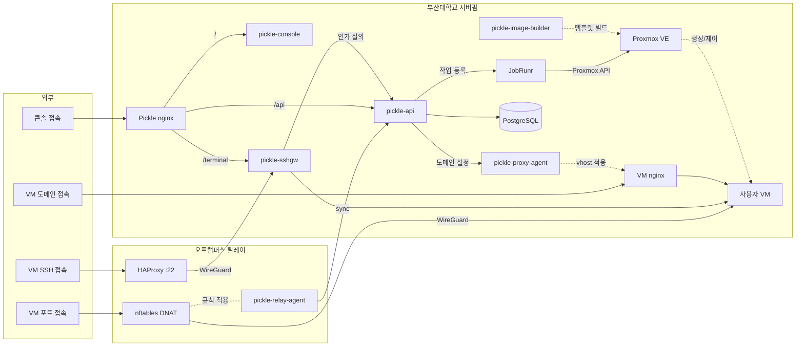

# pickle-sshgw

부산대학교 클라우드 플랫폼(Pickle)의 SSH 게이트웨이입니다.

사용자는 `ssh <vm슬러그>@ssh.pcl.kr` 한 줄로 자기 VM에 접속하고, 게이트웨이가
슬러그를 보고 대상 VM으로 이어 줍니다. 웹 터미널의 데이터 플레인도 이 레포지토리의
데몬이 맡습니다.

개인 식별에는 사용자가 콘솔에 등록한 SSH 공개키를 사용합니다. 누가 어느 VM에 들어갈 수
있는지는 게이트웨이가 정하지 않습니다. 매 연결마다
[pickle-api](https://github.com/PNUops/pickle-api)의 내부 라우트 API에 물어보고 그 판정을
따릅니다.

## 용어

- **슬러그** — VM마다 부여되는 전역 고유 이름입니다. SSH 사용자명 자리에 들어갑니다.
- **다운스트림 / 업스트림** — 클라이언트에서 게이트웨이까지 / 게이트웨이에서 VM까지의
  구간입니다. 업스트림 홉은 플랫폼 전용 ed25519 키로 인증합니다.
- **호스트키 핀** — 각 VM의 호스트키를 프로비저닝 때 수집해 고정해 두고, 이후 접속에서
  불일치하면 연결을 거부합니다.
- **라우트 API** — `POST /internal/sshgw/route`. 공개키 소유자가 해당 VM이 속한 그룹의
  구성원(MEMBER 역할) 이상인지 판정하고 대상 주소를 돌려줍니다.

## 접속 경로

캠퍼스 방화벽이 인바운드를 막기 때문에 오프캠퍼스
`:22`는 외부 릴레이가 받고, 캠퍼스가 아웃바운드로 개통한 WireGuard 터널을 타고
게이트웨이까지 옵니다.

```
client → HAProxy(send-proxy-v2) → WireGuard 터널 → sshgw-proxyfront:22
       (PROXY 필수, 피어 전용)  → sshpiperd:2222(loopback) → route-plugin → VM:22
```

홉이 넷이지만 클라이언트에게는 한 번의 SSH 연결로 보입니다. scp, sftp, VSCode Remote가
그대로 동작하는 투명 파이핑입니다.

브라우저에서 오는 웹 터미널은 다른 경로를 사용합니다.

```
브라우저 ──WSS /terminal/ws──▶ 리버스 프록시 ──▶ terminal-bridge:8082 ──잠금 SSH──▶ VM:22
pickle-api ──티켓 발급·재검증·강제 종료──▶ 제어 포트:8083
```

판정과 감사는 전부 pickle-api에 있고, 이 브리지에는 세션 바이트만 흐릅니다.

## 주요 기능

플랫폼은 VM 신청·승인·생성, SSH와 웹 터미널 접속, 도메인 공개, 만료와
삭제까지를 다룹니다. 이 레포지토리가 맡는 부분은 아래와 같습니다.

- **슬러그 접속**: VM의 내부 주소와 포트를 몰라도 슬러그 하나로 접속합니다.
- **공개키 개인 식별**: 접속자는 콘솔에 등록한 공개키로 식별되며, 누가 언제 어느 VM에
  들어왔는지가 기록에 남습니다.
- **호스트키 핀**: 프로비저닝 때 수집해 둔 호스트키와 어긋나면 연결을 거부합니다.
- **웹 터미널 중계**: 브라우저에서 오는 연결을 종단해 VM까지 잠금 SSH로 잇습니다.
- **차단 반영**: 비밀번호 접속은 기본적으로 거부하고, 전역 차단과 VM별 차단을 매
  연결에서 확인합니다. 전역 스위치는 없으면 꺼진 것으로 읽히므로, 값이 아직 심기지
  않은 새 환경에서는 모든 접속이 거부됩니다.
- **세션 강제 종료**: 관리자가 콘솔에서 끊으면 열려 있던 터미널 세션이 즉시 닫힙니다.
- **동시 세션 상한**: 사용자별, VM별, 기관별로 한도를 두어 한 곳이 브리지를 독차지하지
  못하게 합니다.

## 구성 바이너리

커스텀 Go 바이너리 세 종을 이 레포지토리에서 빌드하고, `sshpiperd`는 업스트림
(`github.com/tg123/sshpiper`) 바이너리를 수정 없이 사용합니다. 라우팅 플러그인이 같은
버전을 `libplugin` SDK로 임포트하므로 바이너리와 SDK 버전은 함께 올려야 합니다.

```
cmd/sshgw-proxyfront/       :22 인그레스 프런트 심
cmd/sshgw-route-plugin/     sshpiperd gRPC 라우팅 플러그인
cmd/sshgw-terminal-bridge/  웹 터미널 WS 종단
internal/proxyfront/        헤더 수용·재발행과 바이트 중계
internal/route/             라우트 API 클라이언트
internal/gateway/           플러그인 조립과 세션 파이핑
internal/terminal/          WS ↔ 잠금 SSH 중계, 티켓 redeem, 재검증
scripts/systemd/            서비스 유닛 3종
```

1. **`sshgw-proxyfront`** — `:22` 인그레스 앞단의 얇은 심입니다. PROXY protocol v2 헤더를
   필수로 요구하며, 헤더가 없거나 손상됐거나 WireGuard 피어 밖에서 온 연결은 SSH 바이트를
   한 바이트도 교환하지 않고 끊습니다. 유효한 연결은 복원한 실제 클라이언트 IP를 담아 새
   PROXY 헤더로 loopback sshpiperd에 재발행합니다.
2. **`sshgw-route-plugin`** — sshpiperd의 gRPC 라우팅 플러그인입니다. SSH 사용자명과 실제
   클라이언트 IP로 라우트 API를 호출하고, 응답받은 대상으로 파이핑합니다. 조회가 거부되면
   세션도 거부합니다. 토큰이나 API 주소, 업스트림 키 중 하나라도 없으면 기동하지 않습니다.
3. **`sshgw-terminal-bridge`** — 웹 터미널 WebSocket 종단(`:8082`)과 제어 포트(`:8083`)를
   엽니다. 브라우저 WS를 잠금 SSH 연결로 VM에 중계합니다. 원타임 티켓 redeem과 60초
   재검증, 세션 감사는 pickle-api에 위임합니다. 이 데몬 자체는 데이터베이스도 Proxmox
   토큰도 자격증명 암호 키도 갖고 있지 않습니다.

## 보안 경계

- 세 서비스 모두 비-root `pickle` 계정으로 돌아갑니다. proxyfront만 `:22` 바인드를 위해
  `CAP_NET_BIND_SERVICE`를 추가로 가집니다.
- 브리지가 VM으로 여는 SSH는 curve25519 계열 키 교환과 AEAD 암호군만 허용하고, 서버가
  먼저 여는 채널과 글로벌 요청은 전부 거부합니다.
- 토큰을 사용하는 프로세스는 토큰이 없으면 기동하지 않습니다. 자리표시자 값도 거부합니다.
- 터미널 브리지는 세션 프레임을 검사하지도 저장하지도 않습니다. pickle-api에 남는 것은
  세션 수명주기 감사뿐입니다.
- 브리지의 두 리스너는 와일드카드가 아니라 내부 주소 하나에만 바인드하고, WS와 제어
  포트 각각 정해진 피어 IP 하나만 받습니다.

## 시작하기

```bash
scripts/verify.sh        # shellcheck → gofmt → go vet → build → test → 공개 위생 검사
scripts/build.sh         # → dist/ 에 바이너리 3종
```

테스트는 외부 인프라를 요구하지 않습니다. 테스트가 자체 기동한 SSH 서버를 상대로
파이핑과 거부 경로까지 검증합니다.

Go 1.26과 `shellcheck`이 필요합니다. `verify.sh`는 Go 도구가 없으면 그 단계를 건너뛰지만
셸 린트는 언제나 실행하므로, `shellcheck`이 없으면 검증이 시작하자마자 멈춥니다. 단독으로
돌려볼 수 있는 서비스는 아니며, pickle-api의 내부 API와 WireGuard 터널이 있는 환경을
전제합니다. `scripts/systemd/`의 유닛 3종이 서비스 정의의 단일 출처이므로, 유닛만 고치고
호스트에 동기화하지 않으면 실행 중인 서비스는 그대로 남습니다.

## 구성 (`/etc/pickle/sshgw.env`)

기동에 반드시 필요한 값은 아래와 같습니다.

| 변수 | 프로세스 | 의미 |
|---|---|---|
| `PICKLE_SSHGW_API_BASE` | route-plugin, bridge | pickle-api 주소. route-plugin은 기본값이 없어 비면 기동 거부 |
| `PICKLE_SSHGW_TOKEN` | route-plugin, bridge | 내부 API 공유 bearer. 없으면 기동 거부 |
| `PICKLE_SSHGW_UPSTREAM_KEY_FILE` | route-plugin | 게이트웨이에서 VM으로 가는 ed25519 개인키. 읽기 실패도 기동 거부 |
| `PICKLE_TERMINAL_CONTROL_TOKEN` | bridge | api에서 브리지로 오는 제어 bearer. 게이트웨이 토큰과 따로 폐기 가능 |
| `PICKLE_TERMINAL_CONSOLE_ORIGIN` | bridge | WS 핸드셰이크에서 정확히 일치해야 하는 Origin |

<details>
<summary>전체 환경 변수 표</summary>

| 변수 | 사용처 | 의미 | 기본값 |
|---|---|---|---|
| `PICKLE_SSHGW_TIMEOUT` | route-plugin | 라우트 조회 HTTP 타임아웃 | `5s` |
| `SSHGW_PROXYFRONT_LISTEN` | proxyfront | `:22` 인그레스 주소(WireGuard 인터페이스) | `10.100.100.2:22` |
| `SSHGW_PROXYFRONT_UPSTREAM` | proxyfront | loopback sshpiperd 주소 | `127.0.0.1:2222` |
| `SSHGW_PROXYFRONT_PEER` | proxyfront | 신뢰 WireGuard 피어 CIDR | `10.100.100.1/32` |
| `PICKLE_TERMINAL_WS_LISTEN` | bridge | 브라우저 WS 인그레스 | `172.30.1.30:8082` |
| `PICKLE_TERMINAL_CONTROL_LISTEN` | bridge | 제어 포트 | `172.30.1.30:8083` |
| `PICKLE_TERMINAL_KEY_FILE` | bridge | 터미널 ed25519 개인키 | `/etc/pickle/sshgw/terminal_ed25519_key` |
| `PICKLE_TERMINAL_WS_PEER` | bridge | WS에 닿을 수 있는 유일한 피어(nginx TLS 계층) | `172.30.1.10` |
| `PICKLE_TERMINAL_CONTROL_PEER` | bridge | 제어 포트의 유일한 피어(pickle-api) | `172.30.1.20` |
| `PICKLE_TERMINAL_IDLE_TIMEOUT` | bridge | 입력 없는 세션을 닫기까지의 시간. resize·ping으로는 연장되지 않습니다 | `15m` |
| `PICKLE_TERMINAL_PING_INTERVAL` | bridge | 서버 측 WS ping 주기 | `30s` |
| `PICKLE_TERMINAL_REVALIDATE_INTERVAL` | bridge | 인가 재검증 폴링 주기 | `60s` |
| `PICKLE_TERMINAL_MAX_FRAME` | bridge | WS 수신 프레임 상한. 큰 붙여넣기를 견디도록 1MiB | `1048576` |
| `PICKLE_TERMINAL_MAX_SESSIONS` | bridge | 브리지 전역 동시 세션 상한 | `200` |

모든 변수는 동명의 CLI 플래그로도 줄 수 있습니다. 자격증명 값은 이 레포지토리에 없습니다.

</details>

## 의존성

| 모듈 | 버전 | 용도 |
|---|---|---|
| `github.com/tg123/sshpiper` | v1.5.4 | 플러그인 SDK. sshpiperd 바이너리와 버전 고정 |
| `github.com/coder/websocket` | v1.8.15 | 터미널 브리지 WS |
| `github.com/pires/go-proxyproto` | v0.15.0 | PROXY v2 수용·재발행 |
| `golang.org/x/crypto` | v0.54.0 | SSH 클라이언트, ed25519 |
| `github.com/urfave/cli/v2` | v2.27.7 | 플래그·환경변수 파싱 |
| `github.com/sirupsen/logrus` | v1.9.4 | 구조화 로깅 |

## 전체 아키텍처

<!-- arch:begin — 레포지토리 공통 블록입니다. 손으로 고치지 마세요. -->


| 레포지토리 | 역할 |
|---|---|
| [pickle-api](https://github.com/PNUops/pickle-api) | REST API와 프로비저닝 워커 (Spring Boot 4, Java 25, PostgreSQL 18, JobRunr) |
| [pickle-console](https://github.com/PNUops/pickle-console) | 사용자·관리자 웹 콘솔 (React 19, TypeScript) |
| [pickle-sshgw](https://github.com/PNUops/pickle-sshgw) | SSH 게이트웨이와 웹 터미널 브리지 (sshpiperd, Go) |
| [pickle-proxy-agent](https://github.com/PNUops/pickle-proxy-agent) | nginx 리버스 프록시 제어 에이전트 (Go) |
| [pickle-relay-agent](https://github.com/PNUops/pickle-relay-agent) | 오프캠퍼스 릴레이의 nftables DNAT 에이전트 (Go) |
| [pickle-image-builder](https://github.com/PNUops/pickle-image-builder) | 사용자 VM OS 이미지 빌드 레시피 (shell, virt-customize) |
| [pickle-infra](https://github.com/PNUops/pickle-infra) (비공개) | 인프라 프로비저닝 스크립트와 운영 런북 (shell) |
| [pickle-infra-example](https://github.com/PNUops/pickle-infra-example) | 프로비저닝·배포 스크립트와 런북 샘플 |
| [pickle-secrets](https://github.com/PNUops/pickle-secrets) (비공개) | 호스트 시크릿 볼트 (git-crypt) |
| [pickle-secrets-example](https://github.com/PNUops/pickle-secrets-example) | 볼트 레이아웃과 git-crypt 운용 절차 |
<!-- arch:end -->
